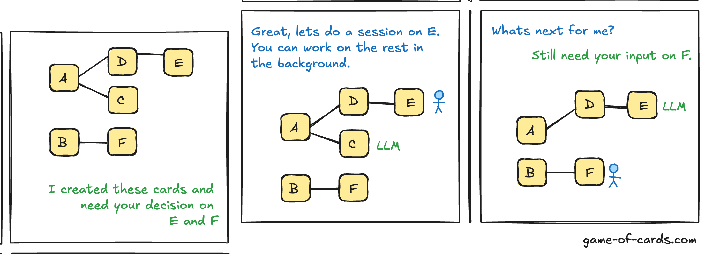
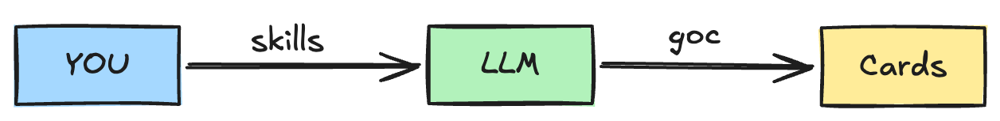

# Game of Cards

Agile for the age of agents — turn work into durable, inspectable cards that humans and LLMs can collaborate on.

<p align="center"></p>

## Try it

In any repo, ask your coding agent:

```
look at game-of-cards.com and use the method for development here
```

That's it. Bootstrapping flows from the PyPI package `game-of-cards`. If you'd rather drive the install by hand, see [`goc.md`](goc.md) for the manual recipe and CLI reference.

## How it works

<p align="center"></p>

You speak in plain English. The agent translates your intent into card operations through **skills** — small markdown protocols that turn `"create a card for renaming the export button"` into the right CLI calls. **`goc`** is the CLI that implements those operations. **Cards** are markdown directories under `.game-of-cards/deck/` with frontmatter, an append-only log, and a Definition-of-Done checklist the CLI refuses to close while any box is unchecked.

Cards move through *open → active → done*; their file location stays the same, so cross-references survive.
Agents only work on cards without a human gate. Others are parked, waiting on decisions or full sessions with you.
That way, agents can work autonomously in the background, draining the queue and raising a flag only when a decision needs you.

## Status

Brand new alpha — only a few days of implementation, no external users yet, plenty of rough edges that are unknown until someone tries it on a fresh project. The right way to find out if it's for you is to install it, point it at a side project, and see whether it stays out of your way for a week.

## More

- [`goc.md`](goc.md) — CLI reference and manual install recipe.
- [`ABOUT.md`](ABOUT.md) — methodology context: why "Game of Cards", agile lineage, and how it relates to other agent-coding tools.
- [`AGENTS.md`](AGENTS.md) — agent operating modes (session / autonomous / Andon-cord).
- [GitHub repo](https://github.com/zauberzeug/game-of-cards) — source, issues, contributions.

## License

MIT — Copyright (c) 2026 Zauberzeug GmbH. See [`LICENSE`](LICENSE).
